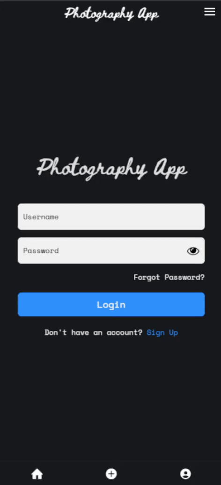
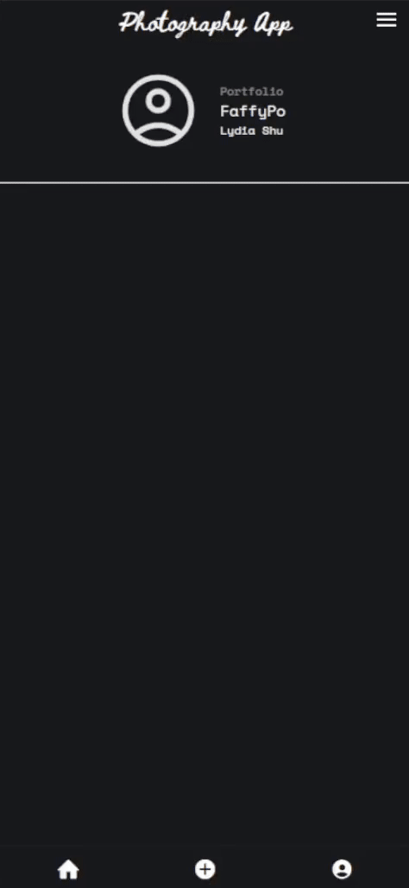
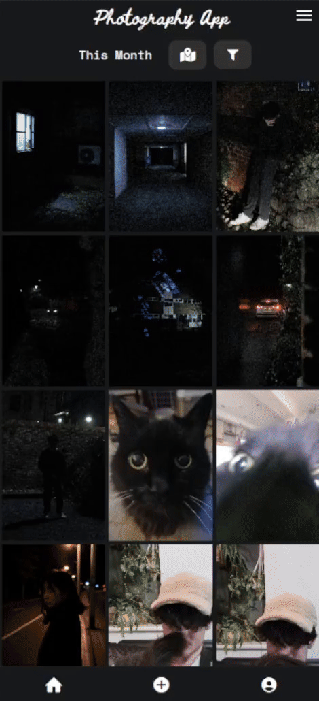

# Photography Sharing & Portfolio App

This photography app is a photo local searching and portfolio web app built on the Expo framework that is cross compatible on web and mobile using React Native, aiming to provide a way to showcase professional photography and get local inspiration.

  

# Contents

- [Why?](#why)
- [Features](#features)
- [Demonstration](#demonstration)
- [Technical Stack](#technical-stack)
- [Known Issues](#known-issues)
- [License](#license)

## Why?

As a movie enthusiast and developer, I wanted a tool to streamline the search for the next movie to watch without having to hop between streaming platforms. This project helped me explore server side rendering, restful APIs, JWT authentication and database design to enable CRUD operations.

## Features

- **Local Photo Search Filtering:** Instantly find photos taken around you to inspire your own creativity.
- **Advanced Search Filters:** Search for photos by camera, lens and camera settings such as ISO, shutter speed, aperture and more.
- **Personal Portfolio:** Upload the photos you take to your own personal portfolio and show it off.

## Demonstration

>The following demonstrations show key interactions and features in action.

### Account Creation

  

---

### Upload Your Photo

  

---

### Proximity Based Search

  Not working as intended at the moment

---

### Advanced Camera Based Filtering

  

---

### Portfolio Profile Page

  

## Technical Stack
- **Frameworks**: Expo
- **Frontend**: React Native, TypeScript
- **Backend**: REST API, Python, Django, PostgreSQL
- **Libraries**: JWT
- **Deployment**: AWS S3
- **Tools**: Figma

## Known Issues
- Some page load animation issues
- IOS is untested
- Android photo upload is broken
- Proximity photo filtering does not apply distance rankings (no change)
 
## Todo
> Feature list planned to be worked on in the future
- **Liking Photos**: Upvote photos you like the vibe of to save them to a list
- **Save Portfolios**: Add portfolios you like to a list you can access
- **Portfolio Customisation**: Profile icons, themes, drag reorder photos, create photo albums
- **Account Management**: Forgotten password, change password, username

## License
This project is licensed under the MIT License.
